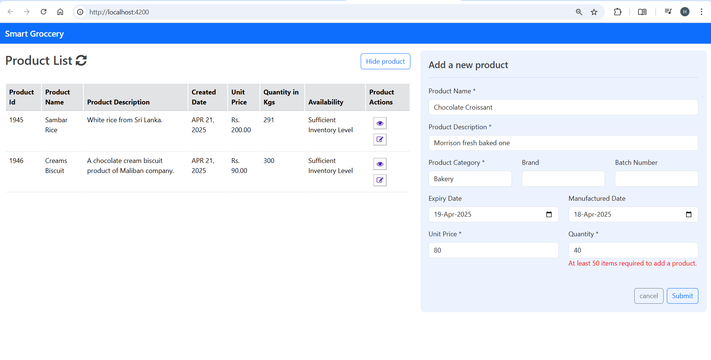

# 🛒 Smart Grocery - Angular Frontend (Reactive Form)

This is a responsive front-end application built using **Angular** for managing grocery inventory. It features a reactive form to add new products and a dynamic table to view the current product list.

---

## 🚀 Features

- 📦 Product listing with live data
- ✍️ Add new products using reactive forms
- ✅ Form validation (e.g., quantity must be ≥ 50)
- 📅 Date pickers for manufacturing and expiry dates
- 👀 View and edit product details
- 🔄 Inventory availability logic (e.g., "Sufficient Inventory Level")

---

## 📸 Screenshot



---

## 🧠 Built With

- **Angular 16+**
- **Reactive Forms (FormGroup, Validators)**
- **TypeScript**
- **Bootstrap 5** (for styling)
- **HTML5 & CSS3**

---

## 🧪 Form Validation Example

- Quantity must be **50 or more** to submit a product.
- All `*` fields are required (Name, Description, Category, Dates, etc.).

When validation fails:

> ❌ *"At least 50 items required to add a product."*

---

## ▶️ How to Run

```bash
git clone https://github.com/YourUsername/angular-smart-grocery.git
cd angular-smart-grocery
npm install
ng serve

Navigate to http://localhost:4200 in your browser.


